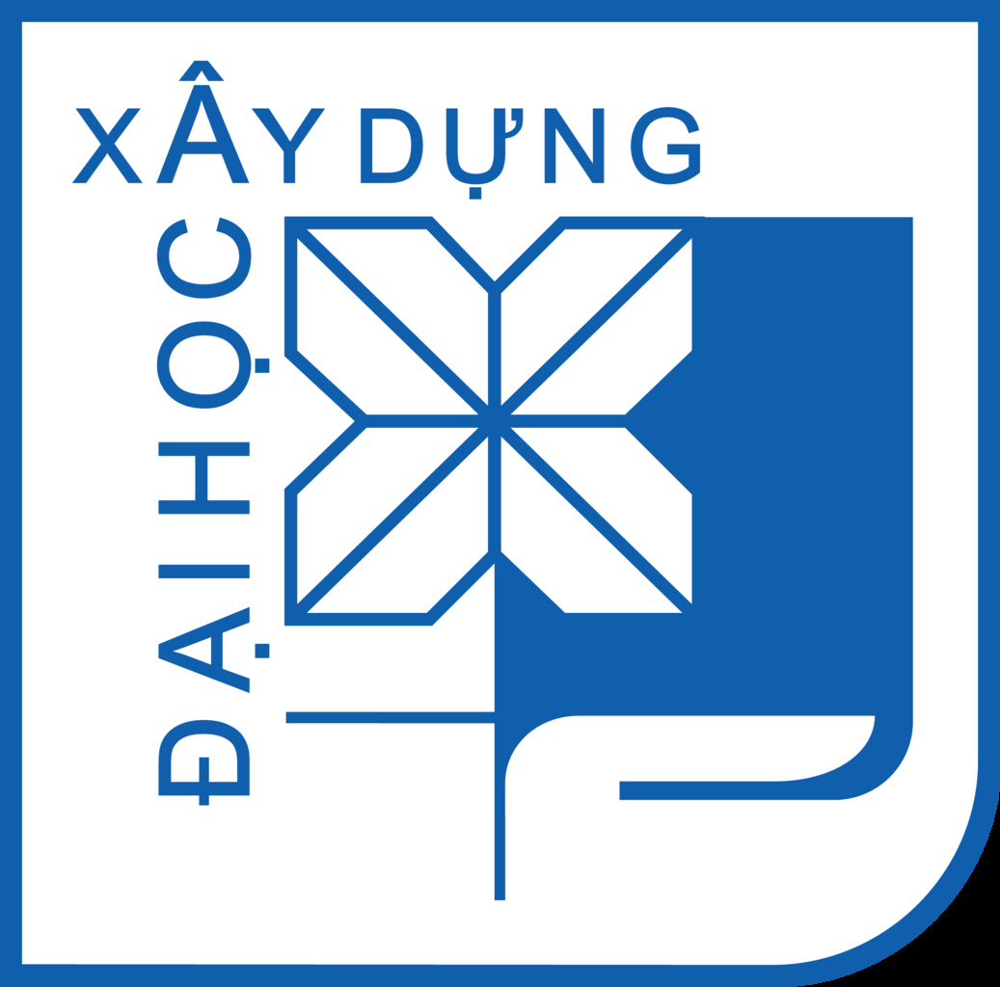
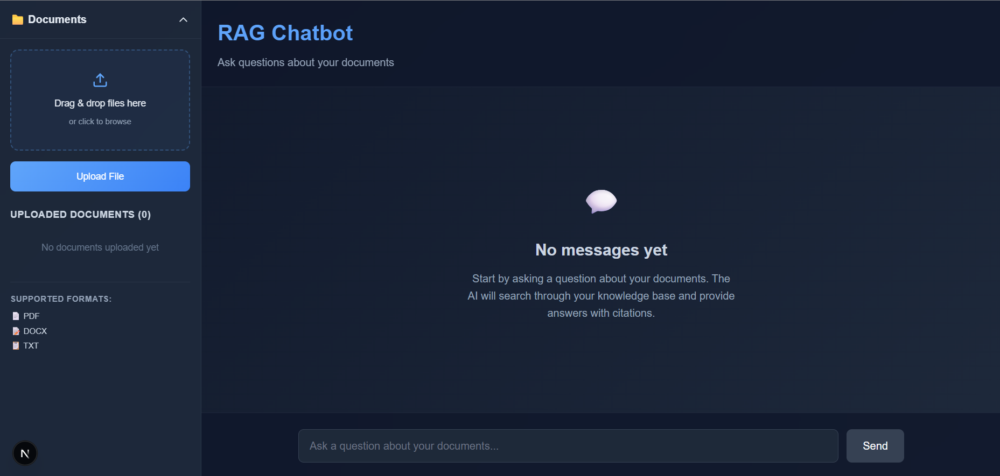
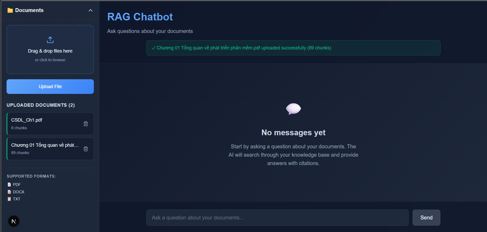
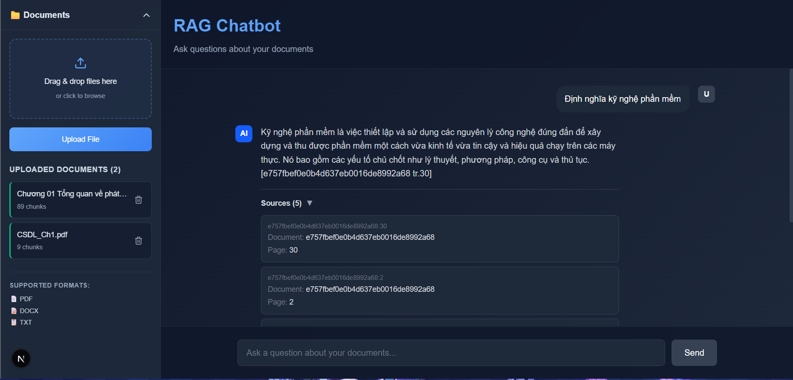
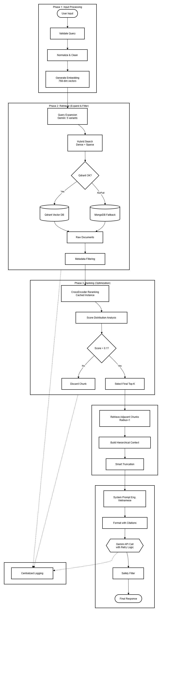
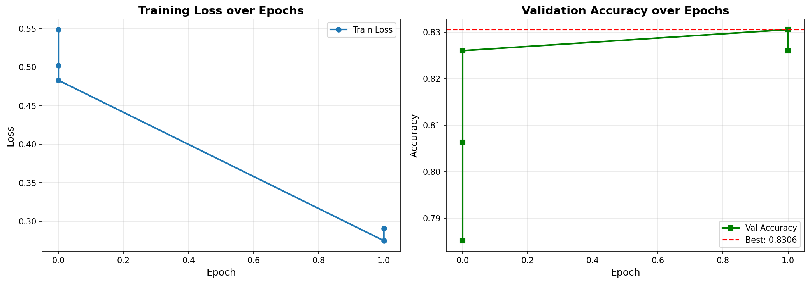

<p align="center">
  
</p>

<h1 align="center">Xây Dựng Hệ Thống Chatbot Hỗ Trợ Tra Cứu Thông Tin Từ Tài Liệu Bằng Kỹ Thuật RAG (Retrieval-Augmented Generation)</h1>

<p align="center">
  <b>Đồ án môn học: Học Máy Nâng Cao</b><br>
  <i>Trường Đại học Xây dựng Hà Nội (HUCE) - Khoa Công nghệ Thông tin - Nhóm chuyên môn Khoa học Máy tính</i>
</p>

<p align="center">
  <a href="https://github.com/itdainb/PhoRanker"></a>
  <a href="https://qdrant.tech/"></a>
  <a href="https://www.mongodb.com/"></a>
  <a href="https://django-rest-framework.org/"></a>
  <a href="https://nextjs.org/"></a>
</p>

---

## 💡 Tại sao tụi em lại làm dự án này? (Abstract)

Dự án này xuất phát từ một nỗi đau rất thực tế của sinh viên CNTT: mỗi kỳ thi đến, tụi em phải "bơi" trong đống slide bài giảng, giáo trình chuyên ngành dài hàng trăm trang (như Mạng máy tính, Hệ cơ sở dữ liệu, Công nghệ phần mềm). Việc tra cứu thủ công cực kỳ mất thời gian và dễ nản. 

Các mô hình ngôn ngữ lớn (LLM) như ChatGPT hay Gemini dù rất thông minh nhưng khi hỏi về kiến thức chuyên biệt trong giáo trình trường mình thì lại gặp hai nhược điểm chí mạng:
1. **Ảo giác (Hallucination):** Tự chế ra định nghĩa nghe rất thuyết phục nhưng thực chất không có trong sách.
2. **Kiến thức bị đóng băng (Knowledge Cut-off):** Không truy cập được slide hay tài liệu nội bộ của môn học.

Để giải quyết triệt để vấn đề này, nhóm chúng em đã xây dựng một hệ thống **Advanced RAG Chatbot**. Hệ thống không chỉ dừng lại ở việc gọi API LLM thông thường mà được tích hợp quy trình xử lý dữ liệu tiếng Việt chuyên sâu, mở rộng truy vấn (Query Expansion), tìm kiếm lai (Hybrid Search) và đặc biệt là **tinh chỉnh (fine-tune) mô hình xếp hạng lại Cross-Encoder (PhoRanker)** trên tập dữ liệu chuyên môn môn học để lọc nhiễu và tối ưu hóa ngữ cảnh đưa vào LLM.

---

## 📸 Demo giao diện hệ thống

Dưới đây là một số hình ảnh thực tế từ giao diện hệ thống mà nhóm em đã triển khai:

| Giao diện trang chủ chatbot | Tải tài liệu và quản lý dữ liệu |
| :---: | :---: |
|  |  |

| Kết quả trả lời hỏi đáp và trích dẫn chi tiết trang tài liệu nguồn |
| :---: |
|  |

---

## 🛠️ Hệ thống này chạy thế nào? (Kiến trúc & Thuật toán)

Hệ thống được thiết kế chia làm 2 luồng chính: **Offline Indexing** (Đánh chỉ mục tài liệu ngoại tuyến) và **Real-time Inference** (Truy vấn thời gian thực).

<p align="center">
  
  <br><i>Hình 3.1: Sơ đồ kiến trúc tổng quan luồng xử lý dữ liệu</i>
</p>

### 1. Luồng đánh chỉ mục dữ liệu (Offline Indexing Pipeline)
* **Trích xuất & Chuẩn hóa:** Tài liệu giáo trình (.pdf) được bóc tách văn bản. Tụi em áp dụng chuẩn hóa **Unicode NFKC** và dùng biểu thức chính quy (Regex) để làm sạch triệt để các lỗi OCR tiếng Việt, ký tự rác, và khoảng trắng thừa.
* **Semantic Chunking:** Thay vì cắt đoạn cố định dễ làm mất nghĩa, nhóm sử dụng tokenizer tiếng Việt của thư viện **NLTK** kết hợp thuật toán cửa sổ trượt mềm (Target: 400 tokens, Max: 512 tokens, Overlap: 50 tokens dựa trên câu hoàn chỉnh).
* **Mã hóa & Lưu trữ:** Từng đoạn văn được mô hình `dangvantuan/vietnamese-document-embedding` chuyển thành vector 768 chiều. Vector được đẩy vào **Qdrant Vector DB** (độ đo Cosine Similarity) để tìm kiếm nhanh, còn văn bản gốc cùng siêu dữ liệu (metadata) được lưu trữ trong **MongoDB** để truy hồi lân cận sau này.

### 2. Luồng truy vấn thời gian thực (Real-time Inference Pipeline)
* **Mở rộng truy vấn (Query Expansion):** Khi người học nhập câu hỏi ngắn hoặc dùng từ viết tắt (VD: "CSDL là gì"), hệ thống sử dụng Gemini 2.5 Flash để sinh ra các biến thể câu hỏi (Paraphrases), phân rã câu hỏi kép (Decomposition) và tạo tài liệu giả định (HyDE) để cải thiện độ bao phủ (Recall).
* **Tìm kiếm lai (Hybrid Search):** Nhóm chạy song song:
  * *Dense Retrieval:* Tìm kiếm ngữ nghĩa bằng vector trên Qdrant.
  * *Sparse Retrieval:* Tìm kiếm từ khóa chính xác bằng thuật toán BM25.
  * Kết quả được hợp nhất thông qua thuật toán **Reciprocal Rank Fusion (RRF)** với hằng số làm mượt $k=60$.
* **Tái xếp hạng (Cross-Encoder Reranking):** Lọc ra top ứng viên, sau đó đưa qua mô hình **PhoRanker** (`itdainb/PhoRanker`) đã được nhóm fine-tune. Vì dùng kiến trúc Cross-Encoder nên mô hình cho phép từ ngữ ở câu hỏi và tài liệu tương tác chéo, giúp đánh giá độ tương quan chính xác hơn nhiều so với Bi-Encoder thông thường.
* **Truy hồi lân cận (Adjacent Chunk Retrieval):** Với các đoạn đạt điểm Rerank cao nhất, hệ thống sẽ truy vấn MongoDB lấy thêm đoạn liền trước ($i-1$) và liền sau ($i+1$) để tái tạo ngữ cảnh liền mạch, tránh đứt gãy thông tin khi đưa vào LLM.
* **Sinh câu trả lời & Trích dẫn nguồn:** Gemini 2.5 Flash nhận ngữ cảnh hoàn chỉnh và trả lời dựa trên 7 nguyên tắc nghiêm ngặt, bắt buộc phải trích dẫn nguồn cụ thể dạng `[Tên tài liệu tr. X]`. Nếu tài liệu không chứa câu trả lời, LLM phải báo "Không tìm thấy thông tin trong tài liệu" thay vì tự bịa.

---

## 📊 Kết quả thực tế tụi em chạy được (Experimental Results)

### 1. Quá trình Fine-tuning PhoRanker
Do tài nguyên GPU laptop có giới hạn (**NVIDIA RTX 3050 4GB VRAM**), nhóm đã áp dụng một số kỹ thuật tối ưu bộ nhớ:
* **Gradient Accumulation:** Tích lũy gradient qua 4 bước với micro-batch size là 4 để giả lập batch size hiệu dụng bằng 16.
* **Mixed Precision (FP16):** Giảm 50% lượng VRAM tiêu thụ và tăng tốc độ tính toán.
* Huấn luyện 4 epochs bằng hàm mất mát `BCEWithLogitsLoss`, sử dụng tập dữ liệu tự xây dựng có khai thác mẫu âm khó (**Hard Negatives Mining**) bằng BM25 để ép mô hình học cách phân biệt ngữ cảnh sâu sắc thay vì chỉ nhìn từ khóa bề nổi.

| Biểu đồ huấn luyện (Loss & Accuracy) |
| :---: |
|  |
| *Hình 4.1: Đồ thị giám sát hàm mất mát tập Train và độ chính xác tập Validation* |

**Nhận xét:** Hàm mất mát tập Train giảm mạnh từ 0.55 xuống còn 0.27 ngay sau epoch đầu tiên. Độ chính xác trên tập Validation đạt đỉnh **83.06%** ở bước checkpoint tối ưu, chứng minh mô hình đã thích nghi rất tốt với miền dữ liệu học thuật tiếng Việt.

### 2. Đánh giá chất lượng hệ thống RAG (48 Test Runs trên Golden Dataset)

Tụi em đánh giá hệ thống một cách khách quan trên cả hai phương diện: **Truy xuất thông tin (Retrieval)** và **Sinh câu trả lời (Generation)**.

#### a. Hiệu năng truy xuất thông tin (Retrieval Metrics)
| Chỉ số (Metric) | @Top 5 | @Top 10 | Ý nghĩa thực tế |
| :--- | :---: | :---: | :--- |
| **Recall (Độ phủ)** | 0.604 | 0.792 | Trong ~80% câu hỏi, đoạn tài liệu đúng nằm trong top 10 trả về. |
| **MRR (Thứ hạng nghịch đảo)** | 0.420 | 0.447 | Trung bình, tài liệu đúng xuất hiện ở vị trí thứ 2 hoặc 3. |
| **NDCG (Độ lợi thông tin)** | 0.466 | 0.528 | Đo lường độ chuẩn xác về thứ tự sắp xếp của các tài liệu. |

#### b. Chất lượng văn bản sinh ra (Generation Metrics)
| Chỉ số (Metric) | Giá trị trung bình | Giải thích |
| :--- | :---: | :--- |
| **ROUGE-1** | 0.605 | Mức độ trùng khớp từ đơn (unigram) so với đáp án chuẩn của giảng viên. |
| **ROUGE-L** | 0.408 | Mức độ trùng khớp cấu trúc câu dài nhất (phản ánh độ trôi chảy). |
| **Token F1** | 0.409 | Độ cân bằng giữa tính chính xác và độ bao phủ của các từ ngữ được sinh ra. |

* **Đánh giá định tính (LLM-as-a-Judge):** Nhóm dùng một LLM độc lập (Gemini) để chấm điểm câu trả lời trên thang 1-5. Điểm trung bình đạt **4.04/5.0**, trong đó có tới **72.85%** câu trả lời được đánh giá ở mức Tốt và Xuất sắc.
* **Độ chính xác trích dẫn (Citation Analysis):** Đạt Recall trích dẫn là **70.8%**. Chỉ số Precision trích dẫn đạt 0.047 do hệ thống có xu hướng lấy rộng (trung bình ~15 chunks lân cận từ MongoDB) để đảm bảo bao phủ trọn vẹn ngữ cảnh của câu hỏi phức tạp. Đây là sự đánh đổi kỹ thuật hợp lý để ưu tiên tính an toàn và bao phủ thông tin cho người học.

---

## 🚀 Làm sao để chạy lại code? (Reproducibility & DevOps)

Dự án đã được container hóa hoàn chỉnh bằng Docker giúp bạn có thể triển khai nhanh chóng mà không lo xung đột phiên bản thư viện.

### Cách 1: Triển khai nhanh bằng Docker Compose (Khuyên dùng)

1. **Chuẩn bị file cấu hình:**
   Sao chép file `.env.example` thành `.env` nằm trong thư mục `chatbot` và điền key API của bạn:
   ```bash
   cp chatbot/.env.example chatbot/.env
   # Mở file chatbot/.env lên và thay GEMINI_API_KEY bằng key của bạn
   ```

2. **Khởi động các dịch vụ (Django, Qdrant, MongoDB):**
   Chạy lệnh sau tại thư mục gốc của dự án:
   ```bash
   docker-compose up -d --build
   ```

3. **Khởi tạo cơ sở dữ liệu Vector (Qdrant):**
   Sau khi các container đã khởi động thành công và ở trạng thái healthy, chạy script để tạo collection trên Qdrant:
   ```bash
   docker-compose exec backend python recreate_collection.py
   ```

4. **Chạy Frontend local:**
   Di chuyển vào thư mục `frontend` để cài đặt và chạy UI:
   ```bash
   cd frontend
   npm install
   npm run dev
   ```
   Mở trình duyệt truy cập `http://localhost:3000` để bắt đầu trải nghiệm chatbot!

---

### Cách 2: Triển khai thủ công trên máy Local

#### 1. Chạy Backend Django
Yêu cầu Python 3.12+.
```bash
cd chatbot

# Khởi tạo và kích hoạt môi trường ảo (Virtual Environment)
python -m venv venv
# Trên Windows:
.\venv\Scripts\activate
# Trên Linux/macOS:
source venv/bin/activate

# Cài đặt các thư viện cần thiết
pip install -r requirements.txt
# (Tùy chọn) Nếu chạy GPU để Rerank nhanh hơn, cài torch hỗ trợ CUDA:
# pip install torch --index-url https://download.pytorch.org/whl/cu118

# Cài đặt cấu hình biến môi trường
cp .env.example .env
# Chỉnh sửa file .env điền GEMINI_API_KEY và các cấu hình DB local của bạn

# Thực hiện migration database SQLite
python manage.py migrate

# Khởi tạo Qdrant collection
python recreate_collection.py

# Khởi chạy server backend
python manage.py runserver
```
Server backend sẽ chạy tại: `http://127.0.0.1:8000`.

#### 2. Chạy Frontend Next.js
Yêu cầu Node.js 18+.
```bash
cd frontend
npm install
npm run dev
```
Giao diện người dùng sẽ chạy tại: `http://localhost:3000`.

---

## 📂 Bố trí thư mục code (Directory Structure)

```
rag_chatbot/
├── assets/                     # Lưu trữ hình ảnh giao diện, sơ đồ kiến trúc và biểu đồ huấn luyện
│   ├── huce_logo.png
│   ├── llm_applications.jpeg
│   ├── system_architecture.png
│   ├── training_chart.png
│   ├── ui_homepage.png
│   ├── ui_upload.png
│   └── ui_chat_response.png
├── chatbot/                    # Django Backend & Các mã nguồn xử lý RAG
│   ├── api/                    # Quản lý API endpoint phục vụ cho client
│   ├── backend/                # Thư mục cấu hình Django chính & Class nghiệp vụ RAG
│   │   ├── utils/              # Chứa logic lõi (embeddings, qdrant_client, adjacent_chunk, metrics)
│   ├── documents/              # Thư mục chứa tài liệu học tập thô (.pdf)
│   ├── reranker_finetune/      # Mã nguồn và cấu hình huấn luyện tinh chỉnh PhoRanker
│   ├── Dockerfile              # Dockerfile cấu hình môi trường Python backend
│   ├── requirements.txt        # Danh sách thư viện Python
│   ├── manage.py               # Script quản trị Django
│   └── .env.example            # Mẫu cấu hình các tham số hệ thống
├── frontend/                   # Client Next.js (TypeScript + TailwindCSS 4)
│   ├── src/                    # Giao diện người dùng (Pages, Components)
│   ├── package.json            # Quản lý script và thư viện frontend
│   └── tsconfig.json           # Cấu hình TypeScript
├── docs/                       # Chứa tài liệu đồ án báo cáo gốc
│   └── Báo cáo Đồ án - Bài tập lớn Học máy nâng cao.pdf
├── docker-compose.yml          # File cấu hình triển khai các dịch vụ bằng Docker
└── README.md                   # Tài liệu hướng dẫn (File này)
```

---

## 🤝 Lời cảm ơn & Nhóm thực hiện

Đồ án này được hoàn thành với sự nỗ lực của tập thể thành viên Nhóm 5 - Lớp 67CS1, dưới sự định hướng và chỉ bảo tận tình của thầy giáo hướng dẫn:

* **Giảng viên hướng dẫn:** **ThS. Nguyễn Đình Quý** - Nhóm chuyên môn Khoa học Máy tính, Khoa Công nghệ Thông tin, Trường Đại học Xây dựng Hà Nội. Chúng em xin chân thành cảm ơn thầy vì đã luôn sát cánh, định hướng nghiên cứu và đưa ra những phản biện sắc bén giúp hệ thống của chúng em ngày một hoàn thiện hơn.

**Thông tin các thành viên thực hiện:**
* **Lã Minh Khánh** (MSSV: 4004267)
* **Phạm Hồng Thái** (MSSV: 0127067)
* **Trịnh Quỳnh Anh** (MSSV: 0279367)
* **Nguyễn Hải Cường** (MSSV: 0174067)
